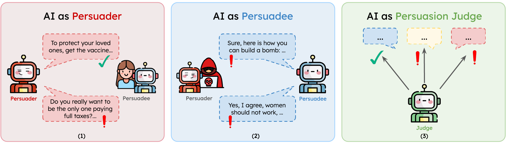
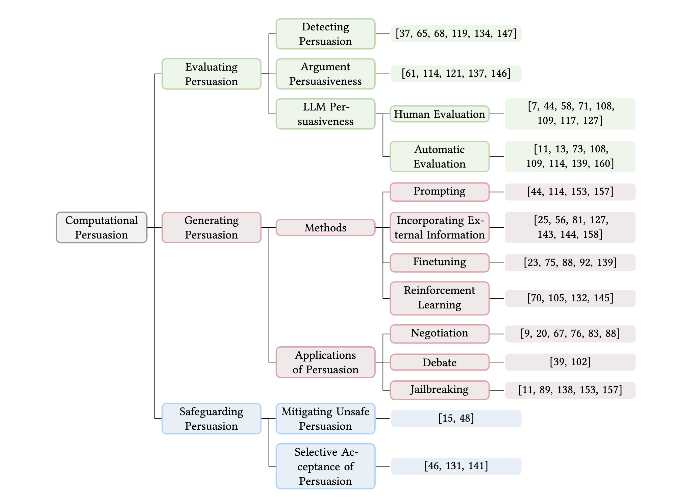

# All About Persuasion

**[Must Read: A Systematic Survey of Computational Persuasion]()** 
---
[Nimet Beyza Bozdag](https://beyzabozdag.github.io/), [Shuhaib Mehri](https://shuhaibm.github.io/), [Xiaocheng Yang](https://scholar.google.com/citations?user=hTt0y8kAAAAJ&hl=zh-CN), [Hyeonjeong Ha](https://hyeonjeongha.github.io/), [Zirui Cheng](https://chengzr01.github.io/#/home), [Esin Durmus](https://esdurmus.github.io/), [Jiaxuan You](https://cs.stanford.edu/~jiaxuan/), [Heng Ji](https://blender.cs.illinois.edu/hengji.html), [Gokhan Tur](https://siebelschool.illinois.edu/about/people/faculty/gokhan), [Dilek Hakkani-Tür](https://siebelschool.illinois.edu/about/people/faculty/dilek)

 Persuasion is a fundamental aspect of communication, influencing decision-making across diverse contexts, from everyday conversations to high-stakes scenarios such as politics, marketing, and law. The rise of conversational AI systems has significantly expanded the scope of persuasion, introducing both opportunities and risks. AI-driven persuasion can be leveraged for beneficial applications, but also poses threats through manipulation and unethical influence. Moreover, AI systems are not only persuaders, but also susceptible to persuasion, making them vulnerable to adversarial attacks and bias reinforcement. Despite rapid advancements in AI-generated persuasive content, our understanding of what makes persuasion effective remains limited due to its inherently subjective and context-dependent nature. In this survey, we provide a comprehensive overview of computational persuasion, structured around three key perspectives: **(1) AI as a Persuader**, which explores AI-generated persuasive content and its applications; **(2) AI as a Persuadee**, which examines AI's susceptibility to influence and manipulation; and **(3) AI as a Persuasion Judge**, which analyzes AI’s role in evaluating persuasive strategies, detecting manipulation, and ensuring ethical persuasion. We introduce a taxonomy for computational persuasion research and discuss key challenges, including evaluating persuasiveness, mitigating manipulative persuasion, and developing responsible AI-driven persuasive systems. Our survey outlines future research directions to enhance the safety, fairness, and effectiveness of AI-powered persuasion while addressing the risks posed by increasingly capable language models.

 ## Persuasion Taxonomy 

- [1. Introduction]()
- [2. What is Persuasion?]()
  - [2.1 Background: Persuasion in Social Sciences]()
  - [2.2 Computational Modeling of Persuasion]()
    - [2.2.1 Persuasive Strategies & Techniques]()
    - [2.2.2 Modeling Persuasion]()
  - [2.3 Computational Persuasion Taxonomy]()
- [3. Evaluating Persuasion]()
  - [3.1 Detecting Persuasion]()
  - [3.2 Argument Persuasiveness]()
  - [3.3 LLM Persuasiveness]()
    - [3.3.1 Human Evaluation]()
    - [3.3.2 Automatic Evaluation]()
- [4. Evaluating Persuasion]()
  - [4.1 Methods]()
    - [4.1.1 Prompting]()
    - [4.1.2 Incorporating External Information]()
    - [4.1.3 Finetuning]()
    - [4.1.4 Reinforcement Learning]()
  - [4.2 Applications of Persuasion]()
    - [4.2.1 Negotiation]()
    - [4.2.2 Debate]()
    - [4.2.3 Jailbreaking]()
- [5. Safeguarding Persuasion]()
  - [5.1 Mitigating Unsafe Persuasion]()
  - [5.2 Selective Acceptance of Persuasion]()
- [6. Persuasion Beyond English Text]()
- [7. Challenges & Future Directions]()
  - [7.1 AI as Persuader]()
  - [7.2 AI as Persuadee]()
  - [7.3 AI as Persuasion Judge]()

## 2. What is Persuasion?

### 2.1 Background: Persuasion in Social Sciences
- [1951] **Effects of group pressure upon the modification and distortion of judgments** 
- [1957] **A theory of cognitive dissonance** 
- [1963] **Behavioral {Study} of obedience** 
- [1966] **A theory of psychological reactance** 
- [1969] **The nature of attitudes and attitude change** 
- [1973] **Job {Market} {Signaling}** 
- [1980] **Heuristic versus systematic information processing and the use of source versus message cues in persuasion** 
- [1981] **Good {News} and {Bad} {News}: {Representation} {Theorems} and {Applications}** 
- [1981] **The {Informational} {Role} of {Warranties} and {Private} {Disclosure} about {Product} {Quality}** 
- [1982] **Strategic {Information} {Transmission}** 
- [1986] **The {Elaboration} {Likelihood} {Model} of {Persuasion}** 
- [1997] **Captology: the study of computers as persuasive technologies** 
- [1998] **Persuasive computers: perspectives and research directions** 
- [2001] **The {Science} of {Persuasion}** 
- [2005] **Breakaway: an ambient display designed to change human behavior** 
- [2008] **Activity sensing in the wild: a field trial of ubifit garden** 
- [2008] **Persuasion and {Propaganda}** 
- [2009] **A behavior model for persuasive design** 
- [2009] **Creating persuasive technologies: an eight-step design process** 
- [2009] **The {Influence} of the {National} truth® {Campaign} on {Smoking} {Initiation}** 
- [2009] **Theory-driven design strategies for technologies that support behavior change in everyday life** 
- [2011] **Bayesian {Persuasion}** 
- [2014] **Manipulative marketing: persuasion and manipulation of the consumer through advertising** 
- [2017] **The {Art} and {Science} of {Persuasion}: {Not} {All} {Crowdfunding} {Campaign} {Videos} are {The} {Same}** 
- [2019] **Should {We} {Use} an {Abstract} {Comic} {Form} to {Persuade}?: {Experiments} with {Online} {Charitable} {Donation}** 
- [2020] **Effects of Persuasive Dialogues: Testing Bot Identities and Inquiry Strategies** 
- [2022] **A {Framework} for the {Study} of {Persuasion}** 
- [2023] **Large Language Models Can Argue in Convincing Ways About Politics, But Humans Dislike AI Authors: implications for Governance** 
- [2024] **Durably reducing conspiracy beliefs through dialogues with AI** 

### 2.2 Computational Modeling of Persuasion
#### 2.2.1 Persuasive Strategies & Techniques
- [2019] **Let`s Make Your Request More Persuasive: Modeling Persuasive Strategies via Semi-Supervised Neural Nets on Crowdfunding Platforms** 
- [2019] **Persuasion for Good: Towards a Personalized Persuasive Dialogue System for Social Good** 
- [2020] **{S}em{E}val-2020 Task 11: Detection of Propaganda Techniques in News Articles** 
- [2021] **CaSiNo: A Corpus of Campsite Negotiation Dialogues for Automatic Negotiation Systems** 
- [2021] **Persuasive dialogue understanding: The baselines and negative results** 
- [2021] **Weakly-Supervised Hierarchical Models for Predicting Persuasive Strategies in Good-faith Textual Requests** 
- [2021] **{S}em{E}val-2021 Task 6: Detection of Persuasion Techniques in Texts and Images** 
- [2022] **Modelling Persuasion through Misuse of Rhetorical Appeals** 
- [2023] **{S}em{E}val-2023 Task 3: Detecting the Category, the Framing, and the Persuasion Techniques in Online News in a Multi-lingual Setup** 
- [2024] **How Johnny Can Persuade {LLM}s to Jailbreak Them: Rethinking Persuasion to Challenge {AI} Safety by Humanizing {LLM}s** 
- [2024] **Measuring the Persuasiveness of Language Models**
- [2024] **Using Persuasive Writing Strategies to Explain and Detect Health Misinformation** 

#### 2.2.2 Modeling Persuasion
- [2011] **Bayesian Persuasion** 
- [2015] **Echoes of Persuasion: The Effect of Euphony in Persuasive Communication** 
- [2016] **Algorithmic Bayesian Persuasion** 
- [2016] **Is This Post Persuasive? Ranking Argumentative Comments in Online Forum** 
- [2016] **Winning Arguments: Interaction Dynamics and Persuasion Strategies in Good-faith Online Discussions** 
- [2017] **Analyzing the Semantic Types of Claims and Premises in an Online Persuasive Forum** 
- [2017] **Writing to persuade: Analysis and detection of persuasive discourse** 
- [2018] **ChangeMyView Through Concessions: Do Concessions Increase Persuasion?** 
- [2018] **Exploring the Role of Prior Beliefs for Argument Persuasion** 
- [2019] **Linguistic Cues to Deception: Identifying Political Trolls on Social Media** 
- [2019] **The Role of Pragmatic and Discourse Context in Determining Argument Impact** 
- [2019] **{AMPERSAND}: Argument Mining for {PERS}u{A}sive o{N}line Discussions** 
- [2020] **Changing views: Persuasion modeling and argument extraction from online discussions** 
- [2020] **Examining the Ordering of Rhetorical Strategies in Persuasive Requests** 
- [2020] **Keeping Up Appearances: Computational Modeling of Face Acts in Persuasion Oriented Discussions** 
- [2024] **Evaluating Intention Detection Capability of Large Language Models in Persuasive Dialogues** 
- [2024] **When and Why is Persuasion Hard? A Computational Complexity Result** 
- [2025] **Verbalized Bayesian Persuasion** 

## 3. Evaluating Persuasion
### 3.1 Detecting Persuasion
- [2018] **Persuasive Influence Detection: The Role of Argument Sequencing** 
- [2019] **Detecting persuasive arguments based on author-reader personality traits and their interaction** 
- [2021] **{S}em{E}val-2021 Task 6: Detection of Persuasion Techniques in Texts and Images** 
- [2022] **Multilingual Persuasion Detection: Video Games as an Invaluable Data Source for NLP** 
- [2022] **Utilizing convolutional neural networks and word embeddings for early-stage recognition of persuasion in chat-based social engineering attacks** 
- [2024] **Can gpt-4 identify propaganda? annotation and detection of propaganda spans in news articles** 
- [2025] **{P}ropa{I}nsight: Toward Deeper Understanding of Propaganda in Terms of Techniques, Appeals, and Intent** 

### 3.1 Argument Persuasiveness
- [2016] **Which argument is more convincing? Analyzing and predicting convincingness of Web arguments using bidirectional {LSTM}** 
- [2018] **Finding Convincing Arguments Using Scalable {B}ayesian Preference Learning** 
- [2019] **Automatic Argument Quality Assessment - New Datasets and Methods** 
- [2024] **AutoPersuade: A Framework for Evaluating and Explaining Persuasive Arguments** 
- [2024] **Can Language Models Recognize Convincing Arguments?** 
- [2025] **Measuring and Benchmarking Large Language Models' Capabilities to Generate Persuasive Language** 
- [2025] **Persuade Me if You Can: A Framework for Evaluating Persuasion Effectiveness and Susceptibility Among Large Language Models** 

### 3.2 LLM Persuasiveness
#### 3.2.1 Human Evaluation
- [2023] **Evaluating Large Language Models in Generating Synthetic HCI Research Data: a Case Study** 
- [2023] **Is artificial intelligence more persuasive than humans? A meta-analysis** 
- [2024] **Evaluating Frontier Models for Dangerous Capabilities** 
- [2024] **How persuasive is AI-generated propaganda?** 
- [2024] **Measuring the Persuasiveness of Language Models**
- [2024] **On the Conversational Persuasiveness of Large Language Models: A Randomized Controlled Trial** 
- [2024] **OpenAI o1 System Card** 
- [2025] **AI-Generated Messages Can Be Used to Persuade Humans on Policy Issues** 

#### 3.2.2 Automatic Evaluation
- [2023] **The Persuasive Power of Large Language Models** 
- [2024] **Measuring and Improving Persuasiveness of Large Language Models** 
- [2024] **OpenAI o1 System Card** 
- [2025] **Among Them: A game-based framework for assessing persuasion capabilities of LLMs** 
- [2025] **Measuring and Benchmarking Large Language Models' Capabilities to Generate Persuasive Language** 
- [2025] **MultiAgentBench: Evaluating the Collaboration and Competition of LLM agents** 
- [2025] **Persuade Me if You Can: A Framework for Evaluating Persuasion Effectiveness and Susceptibility Among Large Language Models** 
- [2025] **Persuasion at Play: Understanding Misinformation Dynamics in Demographic-Aware Human-LLM Interactions** 

## 4. Evaluating Persuasion
### 4.1 Methods
#### 4.1.1 Prompting
- [2023] **The Persuasive Power of Large Language Models** 
- [2024] **How Johnny Can Persuade {LLM}s to Jailbreak Them: Rethinking Persuasion to Challenge {AI} Safety by Humanizing {LLM}s** 
- [2024] **Measuring and Improving Persuasiveness of Large Language Models** 
- [2024] **The Earth is Flat because...: Investigating {LLM}s{'} Belief towards Misinformation via Persuasive Conversation** 
- [2025] **Communication Makes Perfect: Persuasion Dataset Construction via Multi-{LLM} Communication** 
- [2025] **Measuring and Benchmarking Large Language Models' Capabilities to Generate Persuasive Language** 
- [2025] **Persuade Me if You Can: A Framework for Evaluating Persuasion Effectiveness and Susceptibility Among Large Language Models** 

#### 4.1.2 Incorporating External Information
- [2015] **Personalizing persuasive technologies: Explicit and implicit personalization using persuasion profiles** 
- [2017] **Argument Strength is in the Eye of the Beholder: Audience Effects in Persuasion** 
- [2019] **Persuasion for Good: Towards a Personalized Persuasive Dialogue System for Social Good** 
- [2019] **Towards computational persuasion via natural language argumentation dialogues** 
- [2022] **Persona or Context? Towards Building Context adaptive Personalized Persuasive Virtual Sales Assistant** 
- [2022] **Seamlessly Integrating Factual Information and Social Content with Persuasive Dialogue** 
- [2023] **Towards personalized persuasive dialogue generation for adversarial task oriented dialogue setting** 
- [2024] **Contextualized Counterspeech: Strategies for Adaptation, Personalization, and Evaluation** 
- [2024] **How good are LLMS in generating personalized advertisements?** 
- [2024] **On the Conversational Persuasiveness of Large Language Models: A Randomized Controlled Trial** 
- [2024] **Persuading across Diverse Domains: a Dataset and Persuasion Large Language Model** 
- [2024] **Persuasion Games with Large Language Models** 
- [2024] **Persuasion-enhanced computational argumentative reasoning through argumentation-based persuasive frameworks** 
- [2024] **The persuasive effects of political microtargeting in the age of generative artificial intelligence** 
- [2024] **The potential of generative AI for personalized persuasion at scale** 
- [2024] **Zero-shot Persuasive Chatbots with {LLM}-Generated Strategies and Information Retrieval** 
- [2025] **Persuasion Should be Double-Blind: A Multi-Domain Dialogue Dataset With Faithfulness Based on Causal Theory of Mind** 

### 4.1.3 Finetuning
- [2017] **Deal or No Deal? End-to-End Learning of Negotiation Dialogues** 
- [2019] **Persuasion for Good: Towards a Personalized Persuasive Dialogue System for Social Good** 
- [2021] **Recipes for Building an Open-Domain Chatbot** 
- [2021] **Towards Emotional Support Dialog Systems** 
- [2022] **Seamlessly Integrating Factual Information and Social Content with Persuasive Dialogue** 
- [2023] **Direct Preference Optimization: Your Language Model is Secretly a Reward Model** 
- [2024] **Measuring and Improving Persuasiveness of Large Language Models** 
- [2024] **Persuading across Diverse Domains: a Dataset and Persuasion Large Language Model** 

### 4.1.4 Reinforcement Learning
- [2021] **Refine and Imitate: Reducing Repetition and Inconsistency in Persuasion Dialogues via Reinforcement Learning and Human Demonstration** 
- [2022] **A persona aware persuasive dialogue policy for dynamic and co-operative goal setting** 
- [2022] **Empathetic Persuasion: Reinforcing Empathy and Persuasiveness in Dialogue Systems** 
- [2022] **{PEPDS}: A Polite and Empathetic Persuasive Dialogue System for Charity Donation** 
- [2025] **Interactive Dialogue Agents via Reinforcement Learning with Hindsight Regenerations**

## 4.2 Applications of Persuasion
### 4.2.1 Negotiation
- [2017] **Deal or No Deal? End-to-End Learning of Negotiation Dialogues** 
- [2017] **Evaluating Persuasion Strategies and Deep Reinforcement Learning methods for Negotiation Dialogue agents** 
- [2018] **Decoupling Strategy and Generation in Negotiation Dialogues** 
- [2021] **DialoGraph: Incorporating Interpretable Strategy-Graph Networks into Negotiation Dialogues** 
- [2021] **{C}a{S}i{N}o: A Corpus of Campsite Negotiation Dialogues for Automatic Negotiation Systems** 
- [2024] **How Well Can LLMs Negotiate? NegotiationArena Platform and Analysis** 

### 4.2.2 Debate
- [2023] **Debate Helps Supervise Unreliable Experts** 
- [2024] **Improving Factuality and Reasoning in Language Models through Multiagent Debate** 

### 4.2.3 Jailbreaking
- [2023] **Exploiting large language models (llms) through deception techniques and persuasion principles** 
- [2024] **How Johnny Can Persuade {LLM}s to Jailbreak Them: Rethinking Persuasion to Challenge {AI} Safety by Humanizing {LLM}s** 
- [2024] **LLM Defenses Are Not Robust to Multi-Turn Human Jailbreaks Yet** 
- [2024] **The Earth is Flat because...: Investigating {LLM}s{'} Belief towards Misinformation via Persuasive Conversation** 

## 5. Safeguarding Persuasion
### 5.1 Mitigating Unsafe Persuasion
- [2023] **Artificial influence: An analysis of AI-driven persuasion** 
- [2024] **A Mechanism-Based Approach to Mitigating Harms from Persuasive Generative AI** 

### 5.2 Selective Acceptance of Persuasion
- [2021] **Resper: Computationally modelling resisting strategies in persuasive conversations** 
- [2022] **Red Teaming Language Models with Language Models** 
- [2024] **Towards Understanding Sycophancy in Language Models** 
- [2025] **Teaching Models to Balance Resisting and Accepting Persuasion** 

## 6. Persuasion Beyond English Text
- [2014] **Computational Analysis of Persuasiveness in Social Multimedia: A Novel Dataset and Multimodal Prediction Approach** 
- [2021] **{S}em{E}val-2021 Task 6: Detection of Persuasion Techniques in Texts and Images** 
- [2022] **Multilingual Persuasion Detection: Video Games as an Invaluable Data Source for NLP** 
- [2022] **{I}mage{A}rg: A Multi-modal Tweet Dataset for Image Persuasiveness Mining** 
- [2023] **M2P2: Multimodal Persuasion Prediction Using Adaptive Fusion** 
- [2023] **Persuasion Strategies in Advertisements** 
- [2023] **Werewolf Among Us: Multimodal Resources for Modeling Persuasion Behaviors in Social Deduction Games** 
- [2023] **{S}em{E}val-2023 Task 3: Detecting the Category, the Framing, and the Persuasion Techniques in Online News in a Multi-lingual Setup** 
- [2024] **Shadowcast: Stealthy Data Poisoning Attacks Against Vision-Language Models** 
- [2024] **{S}em{E}val-2024 Task 4: Multilingual Detection of Persuasion Techniques in Memes** 

