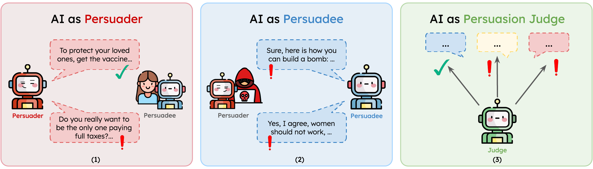
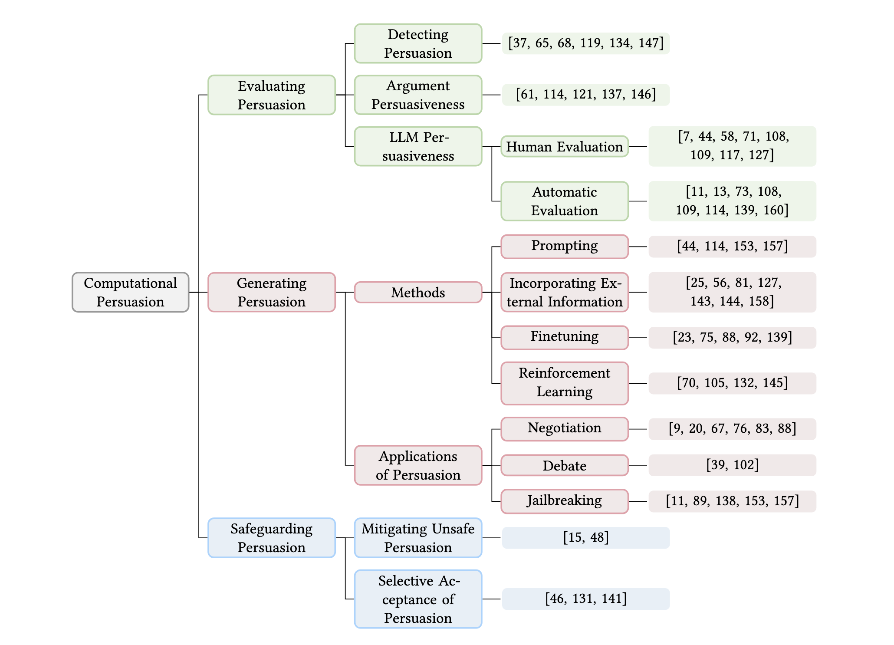

# All About Persuasion
[](https://arxiv.org/pdf/2505.07775) [](https://opensource.org/license/MIT) []([YES](https://github.com/beyzabozdag/PersuasionSurvey/)) []()<br>

> 🚨 **Important Notice**  
> We are actively curating and maintaining a **living, up-to-date collection of research on AI and computational persuasion**.  
> - Newly identified papers are listed in the [**New Papers**](#new-papers) section.  
> - Details on how to suggest additions, corrections, or updates can be found in [**How to Contribute**](#how-to-contribute).  
>  
> This repository is intended to evolve alongside the rapidly growing literature on persuasive AI.

**[Must Read: A Comprehensive Survey of Computational Persuasion]()**<br>
---
[Nimet Beyza Bozdag](https://beyzabozdag.github.io/), [Shuhaib Mehri](https://shuhaibm.github.io/), [Xiaocheng Yang](https://scholar.google.com/citations?user=hTt0y8kAAAAJ&hl=zh-CN), [Hyeonjeong Ha](https://hyeonjeongha.github.io/), [Zirui Cheng](https://chengzr01.github.io/#/home), [Esin Durmus](https://esdurmus.github.io/), [Jiaxuan You](https://cs.stanford.edu/~jiaxuan/), [Heng Ji](https://blender.cs.illinois.edu/hengji.html), [Gokhan Tur](https://siebelschool.illinois.edu/about/people/faculty/gokhan), [Dilek Hakkani-Tür](https://siebelschool.illinois.edu/about/people/faculty/dilek)



 Persuasion is a fundamental aspect of communication, influencing decision-making across diverse contexts, from everyday conversations to high-stakes scenarios such as politics, marketing, and law. The rise of conversational AI systems has significantly expanded the scope of persuasion, introducing both opportunities and risks. AI-driven persuasion can be leveraged for beneficial applications, but also poses threats through manipulation and unethical influence. Moreover, AI systems are not only persuaders, but also susceptible to persuasion, making them vulnerable to adversarial attacks and bias reinforcement. Despite rapid advancements in AI-generated persuasive content, our understanding of what makes persuasion effective remains limited due to its inherently subjective and context-dependent nature. In this survey, we provide a comprehensive overview of computational persuasion, structured around three key perspectives: **(1) AI as a Persuader**, which explores AI-generated persuasive content and its applications; **(2) AI as a Persuadee**, which examines AI's susceptibility to influence and manipulation; and **(3) AI as a Persuasion Judge**, which analyzes AI’s role in evaluating persuasive strategies, detecting manipulation, and ensuring ethical persuasion. We introduce a taxonomy for computational persuasion research and discuss key challenges, including evaluating persuasiveness, mitigating manipulative persuasion, and developing responsible AI-driven persuasive systems. Our survey outlines future research directions to enhance the safety, fairness, and effectiveness of AI-powered persuasion while addressing the risks posed by increasingly capable language models.

---

## Persuasion Taxonomy 


- [1. Introduction]()
- [2. What is Persuasion?](#2-what-is-persuasion)
  - [2.1 Background: Persuasion in Social Sciences](##21-background-persuasion-in-social-sciences)
  - [2.2 Computational Modeling of Persuasion](##22-computational-modeling-of-persuasion)
    - [2.2.1 Persuasive Strategies & Techniques](##222-persuasive-strategies-techniques)
    - [2.2.2 Modeling Persuasion](##222-modeling-persuasion)
  - [2.3 Computational Persuasion Taxonomy]()
- [3. Evaluating Persuasion](#3-evaluating-persuasion)
  - [3.1 Detecting Persuasion](##31-detecting-persuasion)
  - [3.2 Argument Persuasiveness](##32-argument-persuasiveness)
  - [3.3 LLM Persuasiveness](##33-llm-persuasiveness)
    - [3.3.1 Human Evaluation](##331-human-evaluation)
    - [3.3.2 Automatic Evaluation](##332-automatic-evaluation)
- [4. Generating Persuasion](#4-generating-persuasion)
  - [4.1 Methods](##41-methods)
    - [4.1.1 Prompting](##411-prompting)
    - [4.1.2 Incorporating External Information](##412-incorporating-external-information)
    - [4.1.3 Finetuning](##413-finetuning)
    - [4.1.4 Reinforcement Learning](##414-reinforcement-learning)
  - [4.2 Applications of Persuasion](##42-applications-of-persuasion)
    - [4.2.1 Negotiation](##421-negotiation)
    - [4.2.2 Debate](##422-debate)
    - [4.2.3 Jailbreaking](##423-jailbreaking)
- [5. Safeguarding Persuasion](#5-safeguarding-persuasion)
  - [5.1 Mitigating Unsafe Persuasion](##51-mitigating-unsafe-persuasion)
  - [5.2 Selective Acceptance of Persuasion](##52-selective-acceptance-of-persuasion)
- [6. Persuasion Beyond English Text](#6-persuasion-beyond-english-text)
- [7. Challenges & Future Directions]()
  - [7.1 AI as Persuader]()
  - [7.2 AI as Persuadee]()
  - [7.3 AI as Persuasion Judge]()

--- 

## Paper Selection Methodology
To construct a comprehensive taxonomy of computational persuasion, we adopted an iterative, taxonomy-driven literature collection strategy. We began with a small set of foundational papers on persuasive language generation and computational modeling of persuasion, which served as seed papers. From these, we expanded the corpus using both backward and forward citation tracking, recursively identifying additional works that explored persuasion in dialogue systems, argumentation, and social reasoning. As the literature base grew, the emerging conceptual structure informed a taxonomy that grouped papers by their primary focus areas (e.g., evaluation, generation, and safeguarding). This taxonomy, in turn, guided subsequent searches and inclusion decisions. The resulting collection comprised over 150 papers, spanning leading venues such as the ACL, and AAAI as well as repositories like arXiv and the ACM Digital Library. Each identified paper was recorded in a shared spreadsheet, documenting metadata (authors, year, venue), high-level contribution, task focus, and relevant topic tags. Papers were included if they directly addressed persuasion or provided significant computational, methodological, or data-driven foundations for persuasive AI systems. Papers were mostly excluded if they focused exclusively on theoretical or psychological aspects of persuasion without a computational component.

---

### Spreadsheet

While working on the survey, we maintained a shared spreadsheet to track paper collection, categorization, and filtering decisions: **[link_to_sheets](https://docs.google.com/spreadsheets/d/1jyBOjnxF46do1bP5Ltg-EDqU1eCkiFSWDsycUSQ9uD8/edit?usp=sharing)** or under `paper_collection/literature.xlsx`. The spreadsheet is organized into the following sheets:

- **Survey Taxonomy**: Contains the finalized taxonomy used in the survey, along with the papers assigned to each category.
- **Social Sciences and Human-Computer Interaction**: Includes background literature from social sciences and HCI that informs computational perspectives on persuasion.
- **Persuasion Datasets**: Lists datasets relevant to persuasion research, including dialogue, argumentation, and influence-focused benchmarks.
- **Initial Papers**: The unfiltered set of papers used to seed the collection process; additions and removals occur in later stages.
- **Removed**: Papers that were reviewed but ultimately excluded from the final survey, along with brief notes on exclusion rationale.

Note: We share this spreadsheet to add transparency to the paper selection process, while the spreadsheet will not be updated, we aim to maintain a evolving list of AI Persuasion research papers in this repository, please see the notice in the [Important Notice](#important-notice) section for the details.

---

# Paper List

> **🌱 Papers:** To recognize the seed papers that helped start our literature review, we denote them with 🌱.

## 2. What is Persuasion?
### 2.1 Background: Persuasion in Social Sciences
- [1951] **Effects of Group Pressure Upon the Modification and Distortion of Judgments** *Solomon E. Asch. Groups, Leadership and Men: Research in Human Relations 1951.* [[paper](https://www.jstor.org/stable/2011739)]
- [1957] **A Theory of Cognitive Dissonance** *Leon Festinger. Stanford University Press 1957.* [[paper](https://www.jstor.org/stable/2011739)]
- [1963] **Behavioral Study of Obedience** *Stanley Milgram. The Journal of Abnormal and Social Psychology 1963.* [[paper](https://doi.org/10.1037/h0040525)]
- [1966] **A Theory of Psychological Reactance** *Jack W. Brehm. Academic Press 1966.*
- [1969] **The Nature of Attitudes and Attitude Change** *William J. McGuire. The Handbook of Social Psychology.*
- [1973] **Job Market Signaling** *Michael Spence. The Quarterly Journal of Economics 1973.* [[paper](https://academic.oup.com/qje/article-lookup/doi/10.2307/1882010)]
- [1981] **Good News and Bad News: Representation Theorems and Applications** *Paul R. Milgrom. The Bell Journal of Economics 1981.* [[paper](https://www.jstor.org/stable/3003562?origin=crossref)]
- [1980] **Heuristic Versus Systematic Information Processing and the Use of Source Versus Message Cues in Persuasion** *Shelly Chaiken. Journal of Personality and Social Psychology 1980.* [[paper](https://doi.org/10.1037/0022-3514.39.5.752)]
- [1981] **The Informational Role of Warranties and Private Disclosure About Product Quality** *Sanford J. Grossman. The Journal of Law and Economics 1981.* [[paper](https://www.journals.uchicago.edu/doi/10.1086/466995)]
- [1982] **Strategic Information Transmission** *Vincent P. Crawford and Joel Sobel. Econometrica 1982.* [[paper](https://www.jstor.org/stable/1913390?origin=crossref)]
- [1986] **The Elaboration Likelihood Model of Persuasion** *Richard E. Petty et al. Advances in Experimental Social Psychology 1986.* [[paper](https://www.sciencedirect.com/science/article/pii/S0065260108602142)]
- [1997/03] **Captology: The Study of Computers as Persuasive Technologies** *B. J. Fogg. CHI '97 Extended Abstracts on Human Factors in Computing Systems 1997.* [[paper](https://dl.acm.org/doi/10.1145/1120212.1120301)]
- [1998/01] **Persuasive Computers: Perspectives and Research Directions** *B. J. Fogg. Proceedings of the SIGCHI Conference on Human Factors in Computing Systems ACM 1998.* [[paper](https://dl.acm.org/doi/10.1145/274644.274677)]
- [2001] **The Science of Persuasion** *Robert B. Cialdini. Scientific American 2001.* [[paper](https://www.jstor.org/stable/26059056)]
- [2005/04] **Breakaway: an Ambient Display Designed to Change Human Behavior** *Nassim Jafarinaimi et al. CHI EA 2005.* [[paper](https://dl.acm.org/doi/10.1145/1056808.1057063)]
- [2008/04] **Activity Sensing in the Wild: A Field Trial of UbiFit Garden** *Sunny Consolvo et al. CHI 2008.* [[paper](https://dl.acm.org/doi/10.1145/1357054.1357335)]
- [2008] **Persuasion and Propaganda** *Ivana Marková. Diogenes 2008.* [[paper](https://www.cambridge.org/core/journals/diogenes/article/persuasion-and-propaganda/5B877DC7CC09B164EC95FAB20F209EDF)]
- [2009] **The Influence of the National Truth Campaign on Smoking Initiation** *Matthew C. Farrelly et al. American Journal of Preventive Medicine 2009.* [[paper](https://www.ajpmonline.org/article/S0749-3797(09)00074-9/fulltext)]
- [2009/04] **A Behavior Model for Persuasive Design** *B. J. Fogg. Proceedings of the 4th International Conference on Persuasive Technology ACM 2009.* [[paper](https://dl.acm.org/doi/10.1145/1541948.1541999)]
- [2009/04] **Creating Persuasive Technologies: An Eight-Step Design Process** *B. J. Fogg. Proceedings of the 4th International Conference on Persuasive Technology ACM 2009.* [[paper](https://dl.acm.org/doi/10.1145/1541948.1542005)]
- [2009/04] **Theory-Driven Design Strategies for Technologies That Support Behavior Change in Everyday Life** *Sunny Consolvo et al. Proceedings of the SIGCHI Conference on Human Factors in Computing Systems ACM 2009.* [[paper](https://dl.acm.org/doi/10.1145/1518701.1518766)]
- [2011] **Bayesian Persuasion** *Emir Kamenica and Matthew Gentzkow. American Economic Review 2011.* [[paper](https://www.aeaweb.org/articles?id=10.1257/aer.101.6.2590)]
- [2014] **Manipulative Marketing: Persuasion and Manipulation of the Consumer through Advertising** *Victor Danciu. Theoretical and Applied Economics 2014.* [[paper](https://ideas.repec.org//a/agr/journl/vxxiy2014i2(591)p19-34.html)]
- [2015] **Persuasion: Theory and Research** *Daniel J. O'Keefe. SAGE Publications, Thousand Oaks, CA.*
- [2017/02] **The Art and Science of Persuasion: Not All Crowdfunding Campaign Videos Are the Same** *Sanorita Dey et al. CSCW 2017.* [[paper](https://dl.acm.org/doi/10.1145/2998181.2998229)]
- [2019/11] **Should We Use an Abstract Comic Form to Persuade?: Experiments with Online Charitable Donation** *Ziang Xiao et al. PACM HCI (CSCW) 2019.* [[paper](https://dl.acm.org/doi/10.1145/3359177)]
- 🌱 [2020/04] **Effects of Persuasive Dialogues: Testing Bot Identities and Inquiry Strategies** *Weiyan Shi et al. CHI 2020.* [[paper](https://doi.org/10.1145/3313831.3376843)]
- [2022] **A Framework for the Study of Persuasion** *James N. Druckman. Annual Review of Political Science 2022.* [[paper](https://www.annualreviews.org/content/journals/10.1146/annurev-polisci-051120-110428)]
- [2023] **Large Language Models Can Argue in Convincing Ways About Politics, But Humans Dislike AI Authors: Implications for Governance** *Alexis Palmer et al. Political Science 2023.* [[paper](https://doi.org/10.1080/00323187.2024.2335471)]
- [2024/04] **Large Language Models Can Argue in Convincing Ways About Politics, But Humans Dislike AI Authors: Implications for Governance** *Alexis Palmer et al. Political Science.* [[paper](https://doi.org/10.1080/00323187.2024.2335471)]
- [2024/09] **Durably Reducing Conspiracy Beliefs Through Dialogues with AI** *Thomas H. Costello et al. Science.* [[paper](https://www.science.org/doi/abs/10.1126/science.adq1814)]

### 2.2 Computational Modeling of Persuasion
#### 2.2.1 Persuasive Strategies & Techniques
- [2019/06] **Let’s Make Your Request More Persuasive: Modeling Persuasive Strategies via Semi-Supervised Neural Nets on Crowdfunding Platforms** *Diyi Yang et al. NAACL 2019.* [[paper](https://aclanthology.org/N19-1364/)]
- 🌱 [2019/07] **Persuasion for Good: Towards a Personalized Persuasive Dialogue System for Social Good** *Xuewei Wang et al. ACL 2019.* [[paper](https://aclanthology.org/P19-1566/)]
- [2020/12] **SemEval-2020 Task 11: Detection of Propaganda Techniques in News Articles** *Giovanni Da San Martino et al. SemEval 2020.* [[paper](https://aclanthology.org/2020.semeval-1.186/)]
- [2021/01] **Weakly-Supervised Hierarchical Models for Predicting Persuasive Strategies in Good-faith Textual Requests** *Jiaao Chen and Diyi Yang. AAAI 2021.* [[paper](https://arxiv.org/abs/2101.06351)]
- [2021/03] **Persuasive Dialogue Understanding: the Baselines and Negative Results** *Hui Chen et al. Neurocomputing 2021.* [[paper](https://www.sciencedirect.com/science/article/pii/S0925231220318336)]
- [2021/04] **SemEval-2021 Task 6: Detection of Persuasion Techniques in Texts and Images** *Dimitar Dimitrov et al. SemEval 2021.* [[paper](https://aclanthology.org/2021.semeval-1.7/)]
- [2021/06] **CaSiNo: A Corpus of Campsite Negotiation Dialogues for Automatic Negotiation Systems** *Kushal Chawla et al. NAACL 2021.* [[paper](https://aclanthology.org/2021.naacl-main.254.pdf)]
- [2022/12] **Modelling Persuasion through Misuse of Rhetorical Appeals** *Amalie Pauli et al. NLP4PI 2022.* [[paper](https://aclanthology.org/2022.nlp4pi-1.11/)]
- [2023/07] **SemEval-2023 Task 3: Detecting the Category, the Framing, and the Persuasion Techniques in Online News in a Multilingual Setup** *Jakub Piskorski et al. SemEval 2023.* [[paper](https://aclanthology.org/2023.semeval-1.317/)]
- 🌱 [2024/04] **Measuring the Persuasiveness of Language Models** *Esin Durmus et al. Anthropic Research Blog 2024.* [[paper](https://www.anthropic.com/research/measuring-model-persuasiveness)]
- [2024/05] **Using Persuasive Writing Strategies to Explain and Detect Health Misinformation** *Danial Kamali et al. LREC-COLING 2024.* [[paper](https://aclanthology.org/2024.lrec-main.1501/)]
- 🌱 [2024/08] **How Johnny Can Persuade LLMs to Jailbreak Them: Rethinking Persuasion to Challenge AI Safety by Humanizing LLMs** *Yi Zeng et al. ACL 2024.* [[paper](https://aclanthology.org/2024.acl-long.773.pdf)]


#### 2.2.2 Modeling Persuasion
- [2011/10] **Bayesian Persuasion** *Emir Kamenica and Matthew Gentzkow. American Economic Review 2011.* [[paper](https://www.aeaweb.org/articles?id=10.1257/aer.101.6.2590)]
- [2015/05] **Echoes of Persuasion: The Effect of Euphony in Persuasive Communication** *Marco Guerini et al. NAACL 2015.* [[paper](https://aclanthology.org/N15-1172/)]
- [2016/04] **Winning Arguments: Interaction Dynamics and Persuasion Strategies in Good‐faith Online Discussions** *Chenhao Tan et al. WWW 2016.* [[paper](https://doi.org/10.1145/2872427.2883081)]
- [2016/06] **Algorithmic Bayesian Persuasion** *Shaddin Dughmi and Haifeng Xu. STOC 2016.* [[paper](https://dl.acm.org/doi/10.1145/2897518.2897583)]
- [2016/08] **Is This Post Persuasive? Ranking Argumentative Comments in Online Forum** *Zhongyu Wei et al. ACL 2016.* [[paper](https://aclanthology.org/P16-2032.pdf)]
- [2017/03] **Writing to persuade: Analysis and Detection of Persuasive Discourse** *Taraneh Khazaei et al. iConference 2017.* [[paper](https://www.ideals.illinois.edu/items/101725)]
- [2017/10] **Analyzing the Semantic Types of Claims and Premises in an Online Persuasive Forum** *Christopher Hidey et al. ArgMining@EMNLP 2017.* [[paper](https://aclanthology.org/W17-5102.pdf)]
- [2018/06] **ChangeMyView Through Concessions: Do Concessions Increase Persuasion?** *Elena Musi et al. arXiv 2018.* [[paper](https://arxiv.org/abs/1806.03223)]
- [2018/06] **Exploring the Role of Prior Beliefs for Argument Persuasion** *Esin Durmus and Claire Cardie. NAACL 2018.* [[paper](https://aclanthology.org/N18-1094/)]
- [2019/07] **Changing views: Persuasion modeling and argument extraction from online discussions** *Subhabrata Dutta et al. IPM 2019.* [[paper](https://www.sciencedirect.com/science/article/pii/S0306457319301165)]
- [2019/07] **Linguistic Cues to Deception: Identifying Political Trolls on Social Media** *Aseel Addawood et al. AAAI 2019.* [[paper](https://ojs.aaai.org/index.php/ICWSM/article/view/3205)]
- [2019/11] **The Role of Pragmatic and Discourse Context in Determining Argument Impact** *Esin Durmus et al. EMNLP-IJCNLP 2019.* [[paper](https://aclanthology.org/D19-1568/)]
- [2019/11] **AMPERSAND: Argument Mining for PERSuAsive oNline Discussions** *Tuhin Chakrabarty et al. EMNLP-IJCNLP 2019.* [[paper](https://aclanthology.org/D19-1291/)]
- [2020/11] **Examining the Ordering of Rhetorical Strategies in Persuasive Requests** *Omar Shaikh et al. Findings EMNLP 2020.* [[paper](https://aclanthology.org/2020.findings-emnlp.116/)]
- [2020/11] **Keeping Up Appearances: Computational Modeling of Face Acts in Persuasion Oriented Discussions** *Ritam Dutt et al. EMNLP 2020.* [[paper](https://aclanthology.org/2020.emnlp-main.605/)]
- [2024/08] **Evaluating Intention Detection Capability of Large Language Models in Persuasive Dialogues** *Hiromasa Sakura and Yusuke Miyao. ACL 2024.* [[paper](https://aclanthology.org/2024.acl-long.90/)]
- [2024/10] **Decoding Persuasion: A Survey on ML and NLP Methods for the Study of Online Persuasion** *Davide Bassi et al. Frontiers in Communication.* [[paper](https://www.frontiersin.org/journals/communication/articles/10.3389/fcomm.2024.1457433)]
- [2025/02] **When and Why is Persuasion Hard? A Computational Complexity Result** *Zachary Wojtowicz. AIES 2024.* [[paper](https://dl.acm.org/doi/10.5555/3716662.3716800)]
- [2025/02] **Verbalized Bayesian Persuasion** *Wenhao Li et al. arXiv 2025.* [[paper](https://arxiv.org/abs/2502.01587)]


## 3. Evaluating Persuasion
### 3.1 Detecting Persuasion
- 🌱 [2018/02] **Persuasive Influence Detection: The Role of Argument Sequencing** *Christopher Hidey and Kathleen McKeown. AAAI 2018.* [[paper](https://www.cs.columbia.edu/nlp/papers/2018/hidey_aaai18_paper.pdf)]
- [2019/06] **Detecting Persuasive Arguments based on Author-Reader Personality Traits and their Interaction** *Michal Shmueli-Scheuer et al. UMAP 2019.* [[paper](https://doi.org/10.1145/3320435.3320467)]
- [2021/04] **SemEval-2021 Task 6: Detection of Persuasion Techniques in Texts and Images** *Dimitar Dimitrov et al. SemEval 2021.* [[paper](https://aclanthology.org/2021.semeval-1.7/)]
- [2022/07] **Multilingual Persuasion Detection: Video Games as an Invaluable Data Source for NLP** *Teemu Pöyhönen et al. DiGRA 2022.* [[paper](https://arxiv.org/abs/2207.04453)]
- [2022/10] **Utilizing Convolutional Neural Networks and Word Embeddings for Early-Stage Recognition of Persuasion in Chat-Based Social Engineering Attacks** *Nikolaos Tsinganos et al. IEEE 2022.* [[paper](https://doi.org/10.1109/ACCESS.2022.3213681)]
- [2024/05] **Can GPT-4 Identify Propaganda? Annotation and Detection of Propaganda Spans in News Articles** *Maram Hasanain et al. LREC 2024.* [[paper](https://aclanthology.org/2024.lrec-main.244/)]
- [2025/01] **PropaInsight: Toward Deeper Understanding of Propaganda in Terms of Techniques, Appeals, and Intent** *Jiateng Liu et al. COLING 2025.* [[paper](https://aclanthology.org/2025.coling-main.376.pdf)]


### 3.2 Argument Persuasiveness
- [2016/08] **Which argument is more convincing? Analyzing and predicting convincingness of Web arguments using bidirectional LSTM** *Ivan Habernal and Iryna Gurevych et al. ACL 2016.* [[paper](https://aclanthology.org/P16-1150/)]
- [2017/09] **Argument Mining on Twitter: Arguments, Facts and Sources** *Mihai Dusmanu et al. EMNLP 2017.* [[paper](https://aclanthology.org/D17-1245/)]
- [2017/09] **Parsing Argumentation Structures in Persuasive Essays** *Christian Stab and Iryna Gurevych. COLING 2017.* [[paper](https://aclanthology.org/J17-3005/)]
- [2017/10] **Towards Artificial Argumentation** *Katie Atkinson et al. AI Magazine.* [[paper](https://ojs.aaai.org/aimagazine/index.php/aimagazine/article/view/2704)]
- [2018/04] **Argument Mining for Improving the Automated Scoring of Persuasive Essays** *Huy Nguyen and Diane Litman. AAAI 2018.* [[paper](https://ojs.aaai.org/index.php/AAAI/article/view/12046)]
- [2018/06] **Finding Convincing Arguments Using Scalable Bayesian Preference Learning** *Edwin Simpson and Iryna Gurevych. TACL 2018.* [[paper](https://aclanthology.org/Q18-1026/)]
- [2019/11] **Automatic Argument Quality Assessment - New Datasets and Methods** *Assaf Toledo et al. EMNLP-IJCNLP 2019.* [[paper](vhttps://aclanthology.org/D19-1564/)]
- [2019/12] **Argument Mining: A Survey** *John Lawrence and Chris Reed. COLING 2019.* [[paper](https://aclanthology.org/J19-4006/)]
- [2024/11] **AutoPersuade: A Framework for Evaluating and Explaining Persuasive Arguments** *Till Raphael Saenger et al. EMLNP 2024.* [[paper](https://aclanthology.org/2024.emnlp-main.913/)]
- [2024/11] **Can Language Models Recognize Convincing Arguments?** *Paula Rescala et al. Findings EMNLP 2024.* [[paper](https://aclanthology.org/2024.findings-emnlp.515/)]
- [2025/04] **Measuring and Benchmarking Large Language Models' Capabilities to Generate Persuasive Language** *Amalie Brogaard Pauli et al. NAACL 2025.* [[paper](https://aclanthology.org/2025.naacl-long.506.pdf)]

### 3.3 LLM Persuasiveness
#### 3.3.1 Human Evaluation
- [2023/04] **Evaluating Large Language Models in Generating Synthetic HCI Research Data: a Case Study** *Perttu Hämäläinen et al. CHI 2023* [[paper](https://doi.org/10.1145/3544548.3580688)]
- [2023/08] **Is Artificial Intelligence More Persuasive Than Humans? A Meta-Analysis** *Guanxiong Huang and Sai Wang. Journal of Communication 2023.* [[paper](https://doi.org/10.1093/joc/jqad024)]
- [2024/03] **Evaluating Frontier Models for Dangerous Capabilities** *Mary Phuong et al. Preprint, arXiv 2024.* [[paper](https://arxiv.org/abs/2403.13793)]
- [2024/02] **How Persuasive Is AI-Generated Propaganda?** *Josh Goldstein et al. PNAS Nexus 2024.* [[paper](https://academic.oup.com/pnasnexus/article/3/2/pgae034/7610937)]
- 🌱 [2024/04] **Measuring the Persuasiveness of Language Models** *Esin Durmus et al. Anthropic Research Blog 2024.* [[paper](https://www.anthropic.com/research/measuring-model-persuasiveness)]
- [2024/03] **On the Conversational Persuasiveness of Large Language Models: A Randomized Controlled Trial** *Francesco Salvi et al. arXiv.* [[paper](https://arxiv.org/abs/2403.14380)]
- [2024/12] **OpenAI o1 System Card** *OpenAI. 2024.* [[paper](https://cdn.openai.com/o1-system-card-20241205.pdf)]
- [2025/03] **AI-Generated Messages Can Be Used to Persuade Humans on Policy Issues** *Hui Bai et al. Preprint, OSF 2025.* [[paper](https://doi.org/10.31219/osf.io/stakv_v5)]


#### 3.3.2 Automatic Evaluation
- [2024/06] **The Persuasive Power of Large Language Models** *Simon Martin Breum et al. ICWSM 2024.* [[paper](https://arxiv.org/abs/2312.15523)]
- [2024/12] **OpenAI o1 System Card** *OpenAI. 2024.* [[paper](https://cdn.openai.com/o1-system-card-20241205.pdf)]
- [2025/02] **Among Them: A game-based framework for assessing persuasion capabilities of LLMs** *Mateusz Idziejczak et al. arXiv 2025.* [[paper](https://arxiv.org/abs/2502.20426)]
- [2025/03] **MultiAgentBench: Evaluating the Collaboration and Competition of LLM agents** *Kunlun Zhu et al. arXiv 2025.* [[paper](https://arxiv.org/abs/2503.01935)]
- [2025/03] **Persuade Me if You Can: A Framework for Evaluating Persuasion Effectiveness and Susceptibility Among Large Language Models** *Nimet Beyza Bozdag et al. arXiv 2025.* [[paper](https://arxiv.org/abs/2503.01829)]
- [2025/03] **Persuasion at Play: Understanding Misinformation Dynamics in Demographic-Aware Human-LLM Interactions** *Angana Borah et al. arXi 2025.* [[paper](https://arxiv.org/abs/2503.02038)] 
- [2025/04] **Measuring and Benchmarking Large Language Models' Capabilities to Generate Persuasive Language** *Amalie Brogaard Pauli et al. NAACL 2025.* [[paper](https://aclanthology.org/2025.naacl-long.506.pdf)]
- [2025/04] **Measuring and Improving Persuasiveness of Large Language Models** *Somesh Singh et al. ICLR 2025.* [[paper](https://arxiv.org/abs/2410.02653)]


## 4. Generating Persuasion
### 4.1 Methods
- [2024/08] **Computational Argumentation-Based Chatbots: A Survey** *Federico Castagna et al. Journal of Artificial Intelligence Research.* [[paper](http://dx.doi.org/10.1613/jair.1.15407)]

#### 4.1.1 Prompting
- [2024/06] **The Persuasive Power of Large Language Models** *Simon Martin Breum et al. ICWSM 2024.* [[paper](https://arxiv.org/abs/2312.15523)]
- 🌱 [2024/08] **How Johnny Can Persuade LLMs to Jailbreak Them: Rethinking Persuasion to Challenge AI Safety by Humanizing LLMs** *Yi Zeng et al. ACL 2024.* [[paper](https://aclanthology.org/2024.acl-long.773.pdf)]
- 🌱 [2024/08] **The Earth is Flat because...: Investigating LLMs' Belief towards Misinformation via Persuasive Conversation** *Rongwu Xu et al. ACL 2024.* [[paper](https://aclanthology.org/2024.acl-long.858.pdf)]
- [2025/03] **Persuade Me if You Can: A Framework for Evaluating Persuasion Effectiveness and Susceptibility Among Large Language Models** *Nimet Beyza Bozdag et al. arXiv 2025.* [[paper](https://arxiv.org/abs/2503.01829)]
- [2025/04] **Measuring and Improving Persuasiveness of Large Language Models** *Somesh Singh et al. ICLR 2025.* [[paper](https://arxiv.org/abs/2410.02653)]
- [2025/04] **Communication Makes Perfect: Persuasion Dataset Construction via Multi-LLM Communication** *Weicheng Ma et al. NAACL 2025* [[paper](https://aclanthology.org/2025.naacl-long.203/)]
- [2025/04] **Measuring and Benchmarking Large Language Models' Capabilities to Generate Persuasive Language** *Amalie Brogaard Pauli et al. NAACL 2025.* [[paper](https://aclanthology.org/2025.naacl-long.506.pdf)]


#### 4.1.2 Incorporating External Information
- [2015/01] **Personalizing persuasive technologies: Explicit and implicit personalization using persuasion profiles** *Maurits Kaptein et al. IJHCS 2015.* [[paper](https://doi.org/10.1016/j.ijhcs.2015.01.004)]
- [2017/04] **Argument Strength is in the Eye of the Beholder: Audience Effects in Persuasion** *Stephanie Lukin et al. EACL 2017.* [[paper](https://aclanthology.org/E17-1070/)]
- 🌱 [2019/07] **Persuasion for Good: Towards a Personalized Persuasive Dialogue System for Social Good** *Xuewei Wang et al. ACL 2019.* [[paper](https://aclanthology.org/P19-1566/)]
- [2019/09] **Towards Computational Persuasion via Natural Language Argumentation Dialogues** *Anthony Hunter. KI 2019.* [[paper](https://doi.org/10.1007/978-3-030-30179-8_2)]
- [2022/11] **Persona or Context? Towards Building Context-adaptive Personalized Persuasive Virtual Sales Assistant** *Abhisek Tiwari et al. AACL-IJCNLP 2022.* [[paper](https://aclanthology.org/2022.aacl-main.76/)]
- [2022/03] **Seamlessly Integrating Factual Information and Social Content with Persuasive Dialogue** *Maximillian Chen et al. AACL-IJCNLP 2022.* [[paper](https://aclanthology.org/2022.aacl-main.31/)]
- [2023/01] **Towards Personalized Persuasive Dialogue Generation for Adversarial Task-Oriented Dialogue Settings** *Abhisek Tiwari et al. ESwA 2023.* [[paper](https://doi.org/10.1016/j.eswa.2022.118775)]
- [2024/12] **Contextualized Counterspeech: Strategies for Adaptation, Personalization, and Evaluation** *Lorenzo Cima et al. arXiv* [[paper](https://arxiv.org/abs/2412.07338)]
- [2024/03] **On the Conversational Persuasiveness of Large Language Models: A Randomized Controlled Trial** *Francesco Salvi et al. arXiv.* [[paper](https://arxiv.org/abs/2403.14380)]
- [2024/05] **How Good are LLMs in Generating Personalized Advertisements?** *Elyas Meguellati et al. WWW 2024.* [[paper](https://dl.acm.org/doi/10.1145/3589335.3651520#)]
- [2024/08] **Persuading across Diverse Domains: a Dataset and Persuasion Large Language Model** *Chuhao Jin et al. ACL 2024.* [[paper](https://aclanthology.org/2024.acl-long.92/)]
- [2024/08] **Persuasion Games with Large Language Models** *Shirish Karande et al. ICON 2024.* [[paper](https://aclanthology.org/2024.icon-1.67.pdf)]
- [2024/03] **Persuasion-enhanced Computational Argumentative Reasoning through Argumentation-based Persuasive Frameworks** *Ramon Ruiz-Dolz et al. UMUAI 2024.* [[paper](https://doi.org/10.1007/s11257-023-09370-1)]
- [2024/02] **The Persuasive Effects of Political Microtargeting in the Age of Generative Artificial Intelligence** *Almog Simchon et al. PNAS Nexus 2024.* [[paper](https://doi.org/10.1093/pnasnexus/pgae035)]
- 🌱 [2024/11] **Zero-shot Persuasive Chatbots with LLM-Generated Strategies and Information Retrieval** *Kazuaki Furumai et al. EMNLP 2024.* [[paper](https://aclanthology.org/2024.findings-emnlp.656/)]
- [2025/02] **Persuasion Should be Double-Blind: A Multi-Domain Dialogue Dataset With Faithfulness Based on Causal Theory of Mind** *Dingyi Zhang and Deyu Zhou. arXiv* [[paper](https://arxiv.org/abs/2502.21297)]


### 4.1.3 Finetuning
- 🌱 [2017/09] **Deal or No Deal? End-to-End Learning of Negotiation Dialogues** *Mike Lewis et al. EMNLP 2017.* [[paper](https://aclanthology.org/D17-1259.pdf)]
- 🌱 [2019/07] **Persuasion for Good: Towards a Personalized Persuasive Dialogue System for Social Good** *Xuewei Wang et al. ACL 2019.* [[paper](https://aclanthology.org/P19-1566/)]
- [2021/04] **Recipes for Building an Open-Domain Chatbot** *Stephen Roller et al. EACL 2021.* [[paper](https://aclanthology.org/2021.eacl-main.24/)]
- [2021/08] **Towards Emotional Support Dialog Systems** *Siyang Liu et al. ACL 2021.* [[paper](https://aclanthology.org/2021.acl-long.269/)]
- [2022/03] **Seamlessly Integrating Factual Information and Social Content with Persuasive Dialogue** *Maximillian Chen et al. AACL-IJCNLP 2022.* [[paper](https://aclanthology.org/2022.aacl-main.31/)]
- [2024/08] **Persuading across Diverse Domains: a Dataset and Persuasion Large Language Model** *Chuhao Jin et al. ACL 2024.* [[paper](https://aclanthology.org/2024.acl-long.92/)]
- [2025/04] **Measuring and Improving Persuasiveness of Large Language Models** *Somesh Singh et al. ICLR 2025.* [[paper](https://arxiv.org/abs/2410.02653)]


### 4.1.4 Reinforcement Learning
- [2021] **Refine and Imitate: Reducing Repetition and Inconsistency in Persuasion Dialogues via Reinforcement Learning and Human Demonstration** *Weiyan Shi et al. Findings EMNLP 2021* [[paper](https://aclanthology.org/2021.findings-emnlp.295/)]
- [2022/01] **A persona aware persuasive dialogue policy for dynamic and co-operative goal setting** *Abhisek Tiwari et al. ESwA 2022.* [[paper](https://www.sciencedirect.com/science/article/pii/S0957417421016067?via%3Dihub)]
- 🌱 [2022/07] **Empathetic Persuasion: Reinforcing Empathy and Persuasiveness in Dialogue Systems** *Azlaan Mustafa Samad et al. Findings ACL 2022.* [[paper](https://aclanthology.org/2022.findings-naacl.63.pdf)]
- [2022/10] **PEPDS: A Polite and Empathetic Persuasive Dialogue System for Charity Donation** *Kshitij Mishra et al. COLING 2022.* [[paper](https://aclanthology.org/2022.coling-1.34.pdf)]
- [2024/11] **Interactive Dialogue Agents via Reinforcement Learning with Hindsight Regenerations** *Joey Hong et al. arXiv.* [[paper](https://arxiv.org/pdf/2411.05194)]

## 4.2 Applications of Persuasion
### 4.2.1 Negotiation
- 🌱 [2017/09] **Deal or No Deal? End-to-End Learning of Negotiation Dialogues** *Mike Lewis et al. EMNLP 2017.* [[paper](https://aclanthology.org/D17-1259.pdf)]
- [2017/04] **Evaluating Persuasion Strategies and Deep Reinforcement Learning methods for Negotiation Dialogue Agents** *Simon Keize et al. EACL 2017.* [[paper](https://aclanthology.org/E17-2077.pdf)]
- [2018/10] **Decoupling Strategy and Generation in Negotiation Dialogues** *He He et al. EMNLP 2018.* [[paper](https://aclanthology.org/D18-1256.pdf)]
- [2021/04] **DialoGraph: Incorporating Interpretable Strategy-Graph Networks into Negotiation Dialogues** *Rishabh Joshi et al. ICLR 2021* [[paper](https://arxiv.org/abs/2106.00920)]
- [2021/06] **CaSiNo: A Corpus of Campsite Negotiation Dialogues for Automatic Negotiation Systems** *Kushal Chawla et al. NAACL 2021.* [[paper](https://aclanthology.org/2021.naacl-main.254.pdf)]
- 🌱 [2024/02] **How Well Can LLMs Negotiate? NegotiationArena Platform and Analysis** *Federico Bianchi et al. arXiv* [[paper](https://arxiv.org/abs/2402.05863)]

### 4.2.2 Debate
- [2021/03] **An Autonomous Debating System** *Noam Slonim et al. Nature.* [[paper](https://doi.org/10.1038/s41586-021-03215-w)]
- [2023/11] **Debate Helps Supervise Unreliable Experts** *Julian Michael et al. arXiv.* [[paper](https://arxiv.org/pdf/2311.08702)] 
- [2024] **Improving Factuality and Reasoning in Language Models through Multiagent Debate** *Yilun Du et al. ICML 2024.* [[paper](https://dl.acm.org/doi/10.5555/3692070.3692537)]


### 4.2.3 Jailbreaking
- [2023/11] **Exploiting Large Language Models (LLMs) through Deception Techniques and Persuasion Principles** *Sonali Singh et al. IEEE 2023* [[paper](https://arxiv.org/pdf/2311.14876)]
- 🌱 [2024/08] **How Johnny Can Persuade LLMs to Jailbreak Them: Rethinking Persuasion to Challenge AI Safety by Humanizing LLMs** *Yi Zeng et al. ACL 2024.* [[paper](https://aclanthology.org/2024.acl-long.773.pdf)]
- 🌱 [2024/08] **The Earth is Flat because...: Investigating LLMs' Belief towards Misinformation via Persuasive Conversation** *Rongwu Xu et al. ACL 2024.* [[paper](https://aclanthology.org/2024.acl-long.858.pdf)]
- [2024/09] **LLM Defenses Are Not Robust to Multi-Turn Human Jailbreaks Yet** *Nathaniel Li et al. arXiv 2024.* [[paper](https://arxiv.org/pdf/2408.152218)]

## 5. Safeguarding Persuasion
- [2023/02] **Telling Propaganda from Legitimate Political Persuasion** *Amelia Godber and Gloria Origgi. Episteme.* [[paper](https://doi.org/10.1017/epi.2023.10)]
- [2024/03] **Ethics and Responsible AI Deployment** *Petar Radanliev et al. Frontiers in Artificial Intelligence.* [[paper](https://www.frontiersin.org/journals/artificial-intelligence/articles/10.3389/frai.2024.1377011)]
- [2024/10] **Decoding Persuasion: A Survey on ML and NLP Methods for the Study of Online Persuasion** *Davide Bassi et al. Frontiers in Communication.* [[paper](https://www.frontiersin.org/journals/communication/articles/10.3389/fcomm.2024.1457433)]
- [2025/02] **AI Ethics: Integrating Transparency, Fairness, and Privacy in AI Development** *Petar Radanliev et al. Applied Artificial Intelligence.* [[paper](https://doi.org/10.1080/08839514.2025.2463722)]


### 5.1 Mitigating Unsafe Persuasion
- [2023/03] **Artificial influence: An analysis of AI-driven persuasion** *Matthew Burtell and Thomas Woodside. arXiv 2023 .* [[paper](https://arxiv.org/pdf/2303.08721)]
- [2024/04] **A Mechanism-Based Approach to Mitigating Harms from Persuasive Generative AI** *Seliem El-Sayed et al. arXiv 2024.* [[paper](https://arxiv.org/pdf/2404.15058)]

### 5.2 Selective Acceptance of Persuasion
- [2021/04] **ResPer: Computationally Modelling Resisting Strategies in Persuasive Conversations** *Ritam Dutt et al. EACL 2021.* [[paper](https://aclanthology.org/2021.eacl-main.7.pdf)]
- [2024/05] **Towards Understanding Sycophancy in Language Models** *Mrinank Sharma et al. ICLR 2024.* [[paper](https://openreview.net/pdf?id=tvhaxkMKAn)]
- [2025/04] **Teaching Models to Balance Resisting and Accepting Persuasion** **Elias Stengel-Eskin et al. NAACL 2025.* [[paper](https://aclanthology.org/2025.naacl-long.412.pdf)]


## 6. Persuasion Beyond English Text
- [2014/11] **Computational Analysis of Persuasiveness in Social Multimedia: A Novel Dataset and Multimodal Prediction Approach** *Sunghyun Park et al. ICMI 2014.* [[paper](http://doi.acm.org/10.1145/2663204.2663260)]
- [2021/06] **SemEval-2021 Task 6: Detection of Persuasion Techniques in Texts and Images** *Dimitar Dimitrov et al. SemEval 2021.* [[paper](https://aclanthology.org/2021.semeval-1.7/)]
- [2022/07] **Multilingual Persuasion Detection: Video Games as an Invaluable Data Source for NLP** *Teemu Pöyhönen et al. arXiv 2022.* [[paper](https://arxiv.org/abs/2207.04453)]
- [2022/10] **ImageArg: A Multi-modal Tweet Dataset for Image Persuasiveness Mining** *Zhexiong Liu et al. ArgMining@COLING 2022.* [[paper](https://aclanthology.org/2022.argmining-1.1/)]
- [2023/01] **M2P2: Multimodal Persuasion Prediction Using Adaptive Fusion** *Chongyang Bai et al. IEEE 2023.* [[paper](https://doi.org/10.1109/TMM.2021.3134168)]
- [2023/05] **Persuasion Strategies in Advertisements** *Yaman Kumar Singla et al. arXiv 2023.* [[paper](https://arxiv.org/abs/2208.09626v2)]
- [2023/07] **Werewolf Among Us: Multimodal Resources for Modeling Persuasion Behaviors in Social Deduction Games** *Bolin Lai et al. Findings ACL 2023.* [[paper](https://aclanthology.org/2023.findings-acl.411/)]
- [2023/07] **SemEval-2023 Task 3: Detecting the Category, the Framing, and the Persuasion Techniques in Online News in a Multilingual Setup** *Jakub Piskorski et al. SemEval 2023.* [[paper](https://aclanthology.org/2023.semeval-1.317/)]
- [2024/02] **Shadowcast: Stealthy Data Poisoning Attacks Against Vision-Language Models** *Yuancheng Xu et al. arXiv 2024.* [[paper](https://arxiv.org/abs/2402.06659)]
- [2024/05] **SemEval-2024 Task 4: Multilingual Detection of Persuasion Techniques in Memes** *Dimitar Dimitrov et al. SemEval 2024.* [[paper](https://aclanthology.org/2024.semeval-1.275/)]

---

## Revelant but Not Included Papers

> **Exclusion Reasons**  
> Although we aimed to be as inclusive as possible, some papers were not incorporated into the final survey following thorough review and discussion among the authors. Exclusion decisions were guided by the scope and objectives of the survey rather than judgments of quality or relevance. Common reasons for exclusion include:
> 
> - a primary focus on non-computational accounts of persuasion (e.g., purely theoretical, psychological, etc.) without an explicit computational formulation, model, dataset, or empirical evaluation;
> - emphasis on adjacent or enabling tasks (e.g., sentiment analysis, stance detection, rhetoric, framing, or style transfer) where persuasion was not a central research objective or was only indirectly addressed;
> - work that studies general language generation or dialogue quality without isolating persuasion as a distinct capability or evaluation target;
> - papers whose contributions substantially overlap with existing survey literature without introducing new computational methods, tasks, datasets, or evaluation perspectives relevant to this survey;
> - studies focused on human–human persuasion or offline behavioral experiments without a clear connection to computational models or AI systems;
> - scope and space constraints, due to the breadth of the topic and fixed survey length (including references), which necessitated selective inclusion rather than exhaustive coverage.
> 
> We nevertheless acknowledge these works as relevant to the broader persuasion landscape and list them here for completeness and transparency.

- [2016/08] **Coarse-grained Argumentation Features for Scoring Persuasive Essays** *Debanjan Ghosh et al. ACL 2016* [[paper](https://aclanthology.org/P16-2089/)]
- [2017/12] **Persuading Teammates to Give: Systematic versus Heuristic Cues for Soliciting Loans** *Diyi Yang and Robert E. Kraut PACMHCI* [[paper](https://dl.acm.org/doi/abs/10.1145/3134749)]
- [2018/06] **Deconfounded Lexicon Induction for Interpretable Social Science** *Reid Pryzant et al. NAACL 2018* [[paper](https://aclanthology.org/N18-1146/)]
- [2019/07] **Target-Guided Open-Domain Conversation** *Jianheng Tang et al. ACL 2019* [[paper](https://aclanthology.org/P19-1565.pdf)]
- [2019/11] **Finding Generalizable Evidence by Learning to Convince Q&A Models** *Ethan Perez et al. EMNLP-IJCNLP 2019* [[paper](https://aclanthology.org/D19-1244/)]
- [2019/11] **What Gets Echoed? Understanding the “Pointers” in Explanations of Persuasive Arguments** *David Atkinson et al. EMNLP-IJCNLP 2019* [[paper](https://aclanthology.org/D19-1289/)]
- [2020/01] **Towards Explainable Conversational Recommendation** *Zhongxia Chen et al. IJCAI 2020* [[paper](https://www.ijcai.org/proceedings/2020/414)]
- [2021/05] **ArgueTutor: An Adaptive Dialog-Based Learning System for Argumentation Skills** *Thiemo Wambsganss et al. CHI 2021* [[paper](https://dl.acm.org/doi/10.1145/3411764.3445781)]
- [2021/07] **From Argument Search to Argumentative Dialogue: A Topic-independent Approach to Argument Acquisition for Dialogue Systems** *Niklas Rach et al. SIGDIAL 2021* [[paper](https://aclanthology.org/2021.sigdial-1.39/)]
- [2022] **Designing an Automatic Agent for Repeated Language–based Persuasion Games** *Maya Raifer et al. TACL* [[paper](https://aclanthology.org/2022.tacl-1.18/)]
- [2022/04] **Persuasion in the Age of Artificial Intelligence (AI): Theories and Complications of AI-Based Persuasion** *Marco Dehnert and Paul A. Mongeau Human Communication Research* [[paper](https://doi.org/10.1093/hcr/hqac006)]
- [2022/05] **Predicting Decisions in Language Based Persuasion Games** *Reut Apel et al. JAIR* [[paper](https://www.jair.org/index.php/jair/article/view/13510/26781)]
- [2023/07] **Measures of Argument Strength: A Computational, Large-Scale Analysis of Effective Persuasion in Real-World Debates** *Sungbin Youk et al. Communication Methods and Measures 2024* [[paper](https://www.tandfonline.com/doi/abs/10.1080/19312458.2023.2230866)]
- [2023/11] **Anthropic Fall 2023 Debate Progress Update** *Ansh Radhakrishnan. AI Alignment Forum* [[blog](https://www.alignmentforum.org/posts/QtqysYdJRenWFeWc4/anthropic-fall-2023-debate-progress-update)]
- [2024/01] **Sleeper Agents: Training Deceptive LLMs that Persist Through Safety Training** *Evan Hubinger et al. arXiv* [[paper](https://arxiv.org/abs/2401.05566)]
- [2024/02] **Are You Sure? Challenging LLMs Leads to Performance Drops in The FlipFlop Experiment** *Philippe Laban et al. arXiv* [[paper](https://arxiv.org/abs/2311.08596)]
- [2024/04] **Towards Measuring the Representation of Subjective Global Opinions in Language Models** *Esin Durmus et al. arXiv* [[paper](https://arxiv.org/abs/2306.16388)]
- [2024/05] **Empowering Calibrated (Dis-)Trust in Conversational Agents: A User Study on the Persuasive Power of Limitation Disclaimers vs. Authoritative Style** *Luise Metzger et al. CHI 2024* [[paper](https://dl.acm.org/doi/10.1145/3613904.3642122)]
- [2024/08] **Jailbreak Attacks and Defenses Against Large Language Models: A Survey** *Sibo Yi et al. arXiv* [[paper](https://arxiv.org/abs/2407.04295)]
- [2024/08] **AI in Precision Persuasion. Unveiling Tactics and Risks on Social Media** *Gundars Bergmanis-Korāts et al.* [[paper](https://stratcomcoe.org/pdfjs/?file=/publications/download/AI-In-Precision-Persuasion-DIGITAL.pdf)]
- [2024/12] **Can Large Language Model Agents Simulate Human Trust Behaviors?** *Chengxing Xie et al. NeurIPS 2024.* [[paper](https://openreview.net/pdf?id=CeOwahuQic)]
- [2025/01] **Persona-DB: Efficient Large Language Model Personalization for Response Prediction with Collaborative Data Refinement** *Chenkai Sun et al. COLING 2025* [[paper](https://aclanthology.org/2025.coling-main.20.pdf)]
- [2025/01] **ManiTweet: A New Benchmark for Identifying Manipulation of News on Social Media** *Kung-Hsiang Huang et al. COLING 2025* [[paper](https://arxiv.org/abs/2305.14225)]
- [2025/02] **On the Trustworthiness of Generative Foundation Models: Guideline, Assessment, and Perspective** *Yue Huang et al. arXiv* [[paper](https://arxiv.org/abs/2502.14296)]
- [2025/03] **Can (A)I Change Your Mind?** *Miriam Havin et al. arXiv*[[paper](https://arxiv.org/pdf/2503.01844v1)]
- [2025/08] **Great, Now Write an Article About That: The Crescendo Multi-Turn LLM Jailbreak Attack** *Mark Russinovich et al. SEC'25* [[paper](https://www.usenix.org/system/files/conference/usenixsecurity25/sec25cycle1-prepub-805-russinovich.pdf)]
- [2025/11] **I Want to Break Free! Persuasion and Anti-Social Behavior of LLMs in Multi-Agent Settings with Social Hierarchy** *Gian Maria Campedelli et al. TMLR* [[paper](https://openreview.net/pdf?id=FR76oM8eGD)]


## How to Contribute
We welcome contributions from the community. You can help keep this repository up to date by:

- **Opening a GitHub issue** to suggest new papers, report missing citations, or flag errors.
- **Submitting a pull request** to directly add papers, fix links, or improve descriptions.
- **Contacting the authors** (preferably the first author of the survey) via email for substantial suggestions or discussion.

When suggesting a paper, please include a short justification indicating how it relates to computational persuasion and (if applicable) which section(s) it fits best.


## New Papers
This section tracks recently published or newly discovered papers that are candidates for inclusion in future updates of the survey.

- [2025/04] **LLM can be a dangerous persuader: Empirical study of persuasion safety in large language models** *Minqian Liu et al. arXiv 2025.* [[paper](https://arxiv.org/abs/2504.10430)]
- [2025/05] **ToMAP: Training Opponent-Aware LLM Persuaders with Theory of Mind** *Peixuan Han et al. arXiv 2025.* [[paper](https://arxiv.org/abs/2505.22961)]
- [2025/06] **It's the Thought that Counts: Evaluating the Attempts of Frontier LLMs to Persuade on Harmful Topics** *Matthew Kowal et al. arXiv 2025.* [[paper](https://arxiv.org/abs/2506.02873)]
- [2025/09] **Disagreements in Reasoning: How a Model's Thinking Process Dictates Persuasion in Multi-Agent Systems** *Haodong Zhao et al. arXiv 2025.* [[paper](https://arxiv.org/abs/2509.21054)]
- [2025/10] **MMPersuade: A Dataset and Evaluation Framework for Multimodal Persuasion** *Haoyi Qiu et al. arXiv 2025.* [[paper](https://arxiv.org/abs/2510.22768)]
- [2025/10] **Make an Offer They Can't Refuse: Grounding Bayesian Persuasion in Real-World Dialogues without Pre-Commitment** *Buwei He et al. arXiv 2025.* [[paper](https://arxiv.org/abs/2510.13387)]
- [2025/11] **Synthetic Socratic Debates: Examining Persona Effects on Moral Decision and Persuasion Dynamics** *Jiarui Liu et al. EMNLP 2025.* [[paper](https://aclanthology.org/2025.emnlp-main.831/)]
- [2025/11] **Profiling LLM's Copyright Infringement Risks under Adversarial Persuasive Prompting** *Jikai Long et al. Findings EMNLP 2025.* [[paper](https://aclanthology.org/2025.findings-emnlp.855/)]
- [2025/11] **Enhancing Persuasive Dialogue Agents by Synthesizing Cross-Disciplinary Communication Strategies** *Shinnosuke Nozue et al. EMNLP Industry 2025.* [[paper](https://aclanthology.org/2025.emnlp-industry.158/)]
- [2025/11] **Persuasion Dynamics in LLMs: Investigating Robustness and Adaptability in Knowledge and Safety with DuET-PD** *Bryan Chen Zhengyu Tan et al. EMNLP 2025.* [[paper](https://aclanthology.org/2025.emnlp-main.81/)]
- [2026/01] **Scheming Ability in LLM-to-LLM Interactions** *Thao Pham. LLM-based Multi-Agent Systems Workshop 2026.* [[paper](https://openreview.net/forum?id=Mk49gDdKIX)]
- [2026/01] **Vulnerability of LLMs' Belief Systems? LLMs Belief Resistance Check Through Strategic Persuasive Conversation Interventions** *Fan Huang et al. arXiv 2026.* [[paper](https://arxiv.org/abs/2601.13590)]
- [2026/01] **Analysing Differences in Persuasive Language in LLM-Generated Text: Uncovering Stereotypical Gender Patterns** *Amalie Brogaard Pauli et al. arXiv 2026.* [[paper](https://arxiv.org/abs/2601.05751)]
- [2026/02] **AREG: Adversarial Resource Extraction Game for Evaluating Persuasion and Resistance in Large Language Models** *Adib Sakhawat and Fardeen Sadab. arXiv 2026.* [[paper](https://arxiv.org/abs/2602.16639)]
- [2026/02] **Persuasion Propagation in LLM Agents** *Hyejun Jeong et al. arXiv 2026.* [[paper](https://arxiv.org/abs/2602.00851)]
- [2026/03] **Towards Strategic Persuasion with Language Models** *Zirui Cheng and Jiaxuan You. arXiv 2026.* [[paper](https://arxiv.org/abs/2509.22989)]
- [2026/03] **When Agents Persuade: Propaganda Generation and Mitigation in LLMs** *Julia Jose et al. arXiv 2026.* [[paper](https://arxiv.org/abs/2603.04636)]

MORE TO BE ADDED!

## How to Cite

If you find this repository or the survey useful, please cite our paper:

```bibtex
@article{bozdag2025readsystematicsurveycomputational,
      title={Must Read: A Systematic Survey of Computational Persuasion}, 
      author={Nimet Beyza Bozdag and Shuhaib Mehri and Xiaocheng Yang and Hyeonjeong Ha and Zirui Cheng and Esin Durmus and Jiaxuan You and Heng Ji and Gokhan Tur and Dilek Hakkani-Tür},
      journal={arXiv preprint arXiv:2505.07775},
      year={2025},
}
```